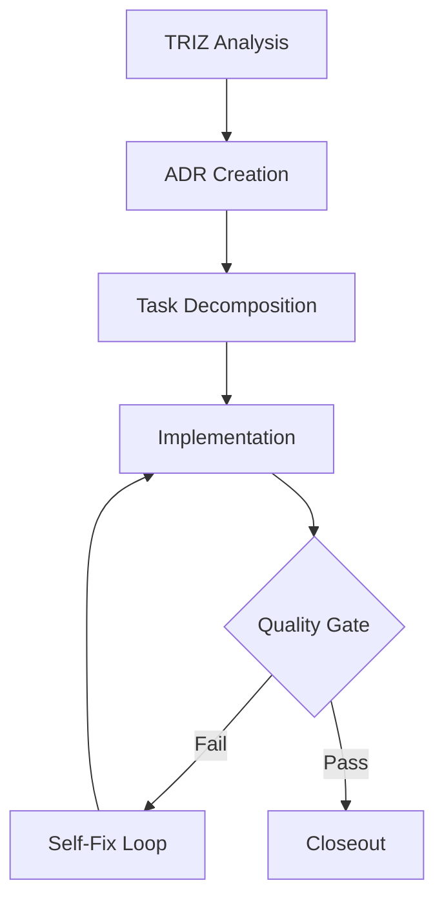

# Agent Orchestration

This document describes the coordination contract for multi-agent workflows within this repository.

## Agent Roles

| Role | Responsibility | Primary Skills |
|------|----------------|----------------|
| **TRIZ Analyst** | Identify architectural contradictions and physical constraints. | `triz-analysis` |
| **ADR Architect** | Resolve contradictions via Architectural Decision Records. | `triz-solver`, `goap-agent` |
| **Task Decomposer** | Break ADRs into actionable tasks and state transitions. | `goap-agent`, `agent-coordination` |
| **Feature Implementer** | Write code and documentation based on task specs. | `feature-implementer`, `audio-vad-cpu` |
| **Quality Agent** | Verify implementation against gates and standards. | `codacy`, `test-runner`, `scripts/quality_gate.sh` |
| **Closeout Agent** | Finalize documentation and sync state. | `update-all-docs.sh`, `ai-commit.sh` |

## Dependency Graph

The standard production flow follows this sequence:

1. **TRIZ**: Surfacing contradictions in `analysis/triz/`.
2. **ADR**: Documenting decisions in `plans/ADR-XXX.md`.
3. **Decomposition**: Updating `plans/GOAP_STATE.md`.
4. **Implementation**: Code changes in `src/`.
5. **Quality Gate**: Running `scripts/quality_gate.sh`.
6. **Closeout**: Finalizing with `scripts/update-all-docs.sh` and `submit`.

## Handoff Protocol

### Handoff Files
All handoffs must be documented in `analysis/handoffs/` using a timestamped Markdown file (e.g., `analysis/handoffs/2026-05-24-impl-to-quality.md`).

### Event Expectations
- **Trigger**: Completion of a phase in `plans/GOAP_STATE.md`.
- **Payload**: Path to the handoff file, current branch, and list of modified files.
- **Verification**: The receiving agent must verify the previous phase's "Success Criteria" before starting.

## Workflow State Contract

The shared state is maintained in `.agents/context/workflow-state.json`.

| Field | Type | Description |
|-------|------|-------------|
| `workflow_id` | UUID/String | Unique identifier for the current session/task. |
| `current_phase` | Enum | `triz` \| `adr` \| `decomposition` \| `implementation` \| `quality_gate` \| `closeout` |
| `active_agent` | String | The role currently owning the workflow. |
| `status` | Enum | `idle` \| `active` \| `blocked` \| `awaiting_review` |
| `plan_ref` | Path | Reference to the active plan in `plans/`. |
| `history` | Array | List of completed transitions and agent handoffs. |

See [.agents/context/workflow-state.json](context/workflow-state.json) for the schema.
