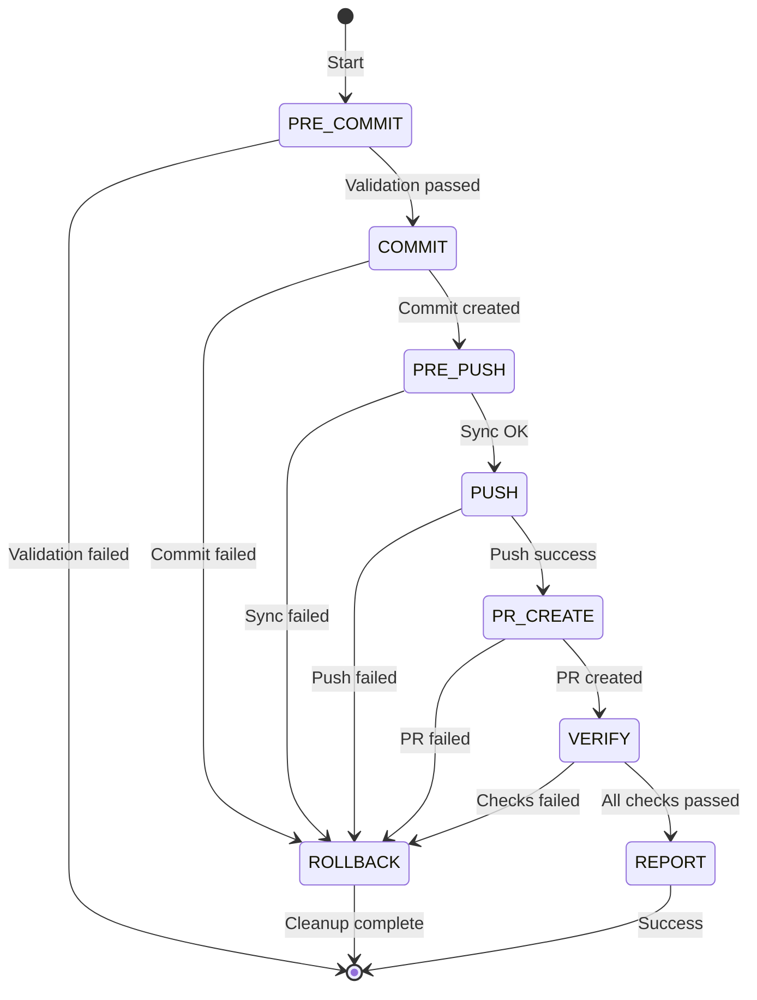

# Atomic Commit Implementation

Technical details for the atomic-commit skill.

## Architecture

The atomic workflow is implemented as a state machine with 7 phases. Each phase is executed by a sub-agent that reports success or failure. On failure, rollback actions are triggered in reverse order.

## State Machine



## Phase Details

### Phase 1: PRE_COMMIT (Validation)

**Entry:** Uncommitted changes, on feature branch

**Operations:**
```bash
./scripts/quality_gate.sh          # Must pass with zero warnings
# Secret scan via grep patterns
# Branch protection check
# gh CLI authentication check
```

**Success Criteria:**
- Quality gate exit 0
- No secrets in staged changes
- Not on protected branch (main/master)
- gh CLI authenticated

**Failure Action:** Abort immediately, no changes made

### Phase 2: COMMIT (Atomic)

**Entry:** Pre-commit passed

**Operations:**
```bash
git add -A
# Auto-detect commit type from files:
# - CI files → ci
# - Test files → test
# - Doc files → docs
# - More additions → feat
# - Else → fix
git commit -m "type(scope): description"
```

**Success Criteria:**
- SHA created
- Conventional format (type(scope): desc)
- Subject ≤ 72 chars

**Rollback Action:**
```bash
git reset --soft HEAD~1
git reset HEAD
```

### Phase 3: PRE_PUSH (Remote Sync)

**Entry:** Commit created

**Operations:**
```bash
git fetch origin
# Check: remote must be ancestor of local
git merge-base --is-ancestor origin/main HEAD
# If behind: attempt rebase
```

**Success Criteria:**
- Remote accessible
- No conflicts (clean merge-base)
- Local branch based on latest origin/main

**Failure Action:** Abort with rebase instructions

**Rollback Action:**
```bash
git reset --soft HEAD~1
git reset HEAD
```

### Phase 4: PUSH (Upload)

**Entry:** Pre-push passed

**Operations:**
```bash
git push -u origin HEAD
# Verify: local SHA == remote SHA
git rev-parse HEAD
git rev-parse origin/HEAD
```

**Success Criteria:**
- Push exit 0
- Local SHA equals remote SHA
- Tracking established

**Rollback Action:**
```bash
# Best effort
git push origin +HEAD~1:branch
```

### Phase 5: PR_CREATE (Open PR)

**Entry:** Push succeeded, gh authenticated

**Operations:**
```bash
gh pr create \
    --title "$(git log -1 --pretty=%s)" \
    --body "$(generate_pr_body)" \
    --base main
```

**PR Body Template:**
```markdown
## Summary

<commit subject>

## Changes

<list of commits>

## Type

<conventional commit type>

## Checklist

- [x] Quality gate passed
- [x] All tests pass
- [x] No secrets in code
- [x] Conventional commit format

## Related

<!-- Link related issues -->
```

**Success Criteria:**
- Valid PR URL returned
- Meaningful body generated
- Correct base branch

**Rollback Action:**
```bash
gh pr close $PR_NUMBER
```

### Phase 6: VERIFY (Wait for CI)

**Entry:** PR created

**Operations:**
```bash
gh pr checks --watch --interval 10
# 30 min timeout
# Zero warnings: grep -qiE "(warning|warn:|deprecated)" = fail
```

**Success Criteria:**
- All checks green (pass/success/✓)
- Zero warnings detected
- Within timeout (default 1800s)

**Failure Action:** Trigger full rollback

### Phase 7: REPORT (Complete)

**Entry:** All checks passed

**Operations:**
- Display success report
- Show PR URL
- Show duration metrics
- Provide next steps

**Output Format:**
```
═══════════════════════════════════════════════════════════════════
║  ATOMIC COMMIT WORKFLOW COMPLETED SUCCESSFULLY                    ║
═══════════════════════════════════════════════════════════════════

  Commit:     <SHA>
  PR:         <URL>
  Duration:   <N>s

  Next steps:
    - Review the PR at the URL above
    - Merge when ready (squash recommended)
```

## Rollback Matrix

| Phase Failed | Rollback Actions (in order) |
|--------------|---------------------------|
| Pre-Commit | None |
| Commit | Unstage, `reset --soft HEAD~1`, `reset HEAD` |
| Pre-Push | `reset --soft HEAD~1`, `reset HEAD` |
| Push | `push origin +HEAD~1:branch`, `reset --soft HEAD~1`, `reset HEAD` |
| PR-Create | `gh pr close`, `push origin +HEAD~1:branch`, `reset --soft HEAD~1`, `reset HEAD` |
| Verify | `gh pr close`, `push origin +HEAD~1:branch`, `reset --soft HEAD~1`, `reset HEAD` |

## Error Codes

| Code | Phase | Meaning |
|------|-------|---------|
| 0 | - | Success |
| 1 | - | Generic failure |
| 2 | PRE_COMMIT | Quality gate failed |
| 3 | COMMIT | Commit failed |
| 4 | PUSH | Push failed |
| 5 | PR_CREATE | PR creation failed |
| 6 | VERIFY | Checks failed/warnings found |
| 7 | VERIFY | Timeout |
| 8 | ROLLBACK | Rollback failed |

## Secret Detection Patterns

```regex
# API Keys
api[_-]?key\s*[:=]\s*['"][a-zA-Z0-9]{16,}['"]

# Passwords
password\s*[:=]\s*['"][^'"]+['"]

# Secrets
secret\s*[:=]\s*['"][a-zA-Z0-9]{16,}['"]

# Private Keys
private[_-]?key\s*[:=]\s*['"][a-zA-Z0-9+/=]{20,}['"]

# AWS Access Key
AKIA[0-9A-Z]{16}

# GitHub Token
gh[pousr]_[A-Za-z0-9_]{36,}
```

## Configuration

**Environment Variables:**
```bash
ATOMIC_COMMIT_TIMEOUT=1800          # CI wait timeout (seconds)
ATOMIC_COMMIT_BASE_BRANCH=main      # Target branch for PR
ATOMIC_COMMIT_NO_ROLLBACK=0         # Set 1 to disable rollback
```

**Command Line Flags:**
```bash
--message, -m     # Commit message
--dry-run         # Validate only
--skip-ci         # Skip CI verification
--timeout         # Override default timeout
--base-branch     # Override base branch
--help, -h        # Show help
```

## Implementation Notes

1. **Zero Warnings Policy**: Any output containing "warning", "warn:", or "deprecated" fails the phase
2. **Best Effort Rollback**: Push rollback may fail if already merged
3. **Feature Branch Required**: Cannot run on main/master branches
4. **gh CLI Required**: PR creation requires authenticated GitHub CLI
5. **Atomicity**: All changes staged with `git add -A` as single commit

## Testing

Run evals to verify:
```bash
# Test dry run mode
/atomic-commit --dry-run

# Test with message
/atomic-commit --message "test: validation"

# Test rollback
/atomic-commit --message "test: rollback" && gh pr close <number>
```
